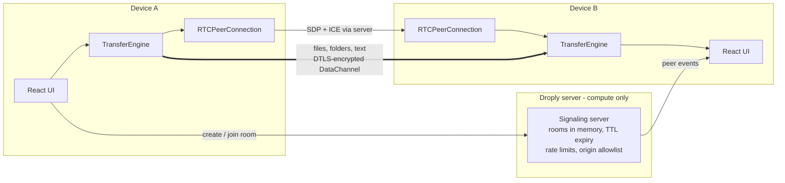

# Droply

> Send files, folders and text directly between devices. No uploads. No accounts. No cloud storage.

[](#testing)
[](#project-layout)
[](./LICENSE)

## Live Demo

**https://droply.allkvd.dev/**

Droply is a browser-based peer-to-peer transfer tool for moving files, folders and text directly between devices without uploading the payload to a server.

## Executive summary

Droply is a browser-based peer-to-peer transfer tool. Create a room, connect a second device with a link,
room code or QR scan — then send files, entire folders (optionally zipped on the fly) or text
straight across. Bytes travel device-to-device over a DTLS-encrypted WebRTC DataChannel; the server
relays only the signaling messages needed to set the connection up. Transfers are
consent-first, optionally password-protected end to end, and resume automatically after a dropped
link.

**Design constraints:** no database, no file storage, no accounts, no uploads. The entire backend is
stateless compute — a single Node process you can host on Render, Fly.io, Railway or any VPS.

## Architecture



The server **never touches file bytes**. In the normal P2P path it sees room codes, anonymous peer
ids and signaling metadata — in memory only, never persisted.

## Feature matrix

| Feature | Detail |
| --- | --- |
| File transfer | Single or multiple files, drag-and-drop, file picker or keyboard; chunked streaming (16 KiB), backpressure, progress, speed + ETA |
| Folder transfer | `webkitdirectory` picker and recursive drag-drop scan; folder structure preserved via sanitized relative paths (zip-slip safe) |
| Zip on the fly | Batch multiple files into one `bundle.zip` using `fflate` — store mode (fast) or deflate (smaller); zipping runs in a worker |
| Web Workers | Chunk reads and zipping run off the main thread with an automatic inline fallback, so large transfers never jank the UI |
| Receiver consent | Nothing is received before the device owner accepts — whole batch or per file/folder selection; offers expire and can be declined |
| Password protection | Optional end-to-end gate: PBKDF2-SHA256 (250k iterations) challenge–verifier handshake, then AES-GCM encrypted chunks; password never leaves the devices |
| Transfer resume | Paused transfers resume from the last byte; dropped links park in-flight work and resume when the connection returns; background tabs keep streaming via event-driven loops + Screen Wake Lock |
| Text transfer | Typed text, clipboard send, per-message copy, conversation history |
| Pairing | Short unguessable room codes (`XXXX-XXXX`, 32-symbol alphabet), QR code, copy link/code, native Web Share |
| UX | Dark/light themes with system detection, responsive layout, WCAG-conscious components (roles, aria-live, keyboard-first drop zone), error boundary, toast notifications |

## Key technical highlights

- **Strict runtime validation everywhere** — every environment variable and every WebSocket frame is
  parsed with zod schemas (backend), and every DataChannel control frame with zod (frontend).
  Invalid config fails fast at boot; malformed frames get typed error codes, never exceptions.
- **Zero-trust transfer protocol** — receiver-driven consent, per-item selection, mutual password
  verification before any payload byte, per-chunk integrity via AES-GCM authentication.
- **Honest state machine** — `idle → connecting → waiting → connecting-peers → ready →
  reconnecting/expired/error`, mirrored in accessible UI (status badge, aria-live regions).
- **Signaling resilience** — capped exponential-backoff reconnect; WebRTC links survive signaling
  blips; in-flight transfers park and resume from their byte offset.
- **Hardened server** — origin allowlist, per-IP token-bucket rate limits (connections, room
  creates/joins, messages), room TTL sweeper, heartbeat liveness, message size caps, malformed-frame
  cutoff, security headers with a strict CSP, SPA-aware static hosting with path-traversal
  protection, health endpoint with live stats.

## Performance notes

- Chunk size 16 KiB with 4 MB high-water / 1 MB low-water buffer thresholds; the sender loop is
  event-driven (`bufferedamountlow`), so throughput tracks the network without polling.
- Progress UI updates are throttled per transfer (150 ms) to keep renders cheap with many
  concurrent transfers.
- A single process comfortably serves signaling traffic; file throughput is bounded by the peers'
  network, not the server. Capacity limits are configurable through environment variables.

## Installation & configuration

Requirements: Node.js 20+ and npm.

```bash
npm install          # installs both workspaces
npm run dev          # backend :3000, frontend :5000 (WS/API proxied)
```

Production:

```bash
npm run build        # frontend bundle -> frontend/dist, backend -> backend/dist
npm start            # serves the app + signaling on $PORT (default 3000)
curl http://localhost:3000/health
```

All settings are environment variables — see [`.env.example`](./.env.example). Key ones:

| Variable | Default | Purpose |
| --- | --- | --- |
| `PORT` / `HOST` | `3000` / `0.0.0.0` | Listen address |
| `ALLOWED_ORIGINS` | (same-origin) | Extra allowed WebSocket origins |
| `TRUST_PROXY` | `false` | Honor `X-Forwarded-For` behind a reverse proxy |
| `ROOM_TTL_SECONDS` | `1800` | Idle room lifetime |
| `MAX_ROOM_PEERS` | `4` | Devices per room |
| `MAX_ROOMS` / `MAX_CONNECTIONS` | `10000` / `500` | Capacity caps |
| `RATE_LIMIT_*` | see `.env.example` | Per-IP throttles |
| `STUN_SERVERS` | Google public STUN | NAT traversal |
| `TURN_URLS` / `TURN_USERNAME` / `TURN_CREDENTIAL` | (empty) | Optional relay for restrictive networks |

The browser fetches ICE servers from `GET /api/config`, so STUN/TURN can change without rebuilding
the frontend.

## Deployment

### Render

Droply is deployed as a single compute-only Node.js service on Render:

- **Live:** https://droply.allkvd.dev/
- **Health:** https://droply.allkvd.dev/health
- **WebSocket signaling:** `wss://droply.allkvd.dev/ws`
- **Blueprint:** [`render.yaml`](./render.yaml)

The deployment uses `npm ci --include=dev && npm run build` so Vite and other build-time development
dependencies are available during the production build. No database or persistent disk is required.

### Docker

The same application can run as a single container anywhere Docker is supported:

```bash
docker build -t droply .
docker run -p 3000:3000 droply
```

No database or disk is provisioned — the service is compute-only by design.

### Relayed connections (TURN)

Most peer pairs connect directly. On strict corporate NATs or some mobile carriers, direct paths
fail; configure a TURN relay (coturn, or a managed service such as Cloudflare Calls or Metered) and
Droply will use it automatically as a fallback. Relayed traffic stays DTLS-encrypted end to end.

## API reference

### HTTP

| Endpoint | Description |
| --- | --- |
| `GET /health` | Liveness + `{ status, rooms, connections }` JSON |
| `GET /api/config` | Public runtime config: ICE servers, `maxRoomPeers`, `roomTtlSeconds` |
| `GET|HEAD /*` | Static frontend with SPA fallback; all other methods → `405` |

### WebSocket signaling (`/ws`)

Client → server: `create-room`, `join-room { roomId }`, `signal { to, sdp | candidate }`.
Server → client: `room-created`, `room-joined`, `peer-joined`, `peer-left`, `signal { from, … }`,
`room-expired`, `error { code, message }`. Frames are strict-validated; codes include
`ROOM_NOT_FOUND`, `ROOM_FULL`, `RATE_LIMITED`, `PROTOCOL_ERROR`, `MESSAGE_TOO_LARGE`.

### DataChannel transfer protocol (`droply-transfer-v1`)

Control frames (JSON): `hello`, `offer { batchId, secure, items[] }`,
`offer-response { batchId, decision, items? }`, `auth-challenge { salt, iterations }`,
`auth-verify { proof }`, `auth-result { ok }`, `file-start { batchId, transferId, file, offset }`,
`file-end`, `transfer-ack`, `transfer-cancel`, `transfer-error`, `text`.
Binary frames: raw 16 KiB file chunks (optionally AES-GCM sealed: `IV ‖ ciphertext`), delivered
between `file-start` and `file-end` on an ordered channel. Details in
[docs/TRANSFER_PROTOCOL.md](./docs/TRANSFER_PROTOCOL.md).

## Testing

```bash
npm run typecheck              # strict TS, both workspaces
npm test                       # backend 48 + frontend 56 tests
npm run test:e2e -w frontend   # Playwright: two real browsers, text + files
```

- **Backend (48):** unit tests for config, protocol, rooms, rate limiting, room ids, plus a live
  integration suite driving real WebSocket clients through create/join/relay/full-room/expiry and
  HTTP endpoints.
- **Frontend (56):** protocol parsing, signaling validation, formatting, component tests, transfer-flow
  integration tests covering consent, per-item selection, password success/failure, zip batching and
  queue draining.
- **E2E (Playwright):** create → join → connect → send text → send small and multi-MB files with
  receiver consent → verify byte-identical downloads, plus landing/404 flows.

## Project layout

```
droply/
├── backend/            # Node + TypeScript signaling server (WebSocket + static hosting)
│   ├── src/            # config (zod), protocol (zod), rooms, rateLimit, signaling, http, server
│   └── test/           # unit + live WebSocket integration tests
├── frontend/           # React 19 + TypeScript app (Vite)
│   ├── src/services/   # signaling, webrtc, transfer (protocol, engine, crypto, workers, zip)
│   ├── src/components/ # DropZone, OfferPanel, PasswordPrompt, TransferItemCard, …
│   └── test/           # unit, component, transfer-flow integration, Playwright E2E
├── docs/               # AUDIT, ARCHITECTURE, TRANSFER_PROTOCOL, SECURITY
├── render.yaml         # one-service compute-only deployment (Render Blueprint)
├── Dockerfile          # multi-stage, non-root, healthcheck
└── .env.example
```

## Privacy model

- Files and text are **not uploaded**; they stream directly between browsers over a DTLS-encrypted
  DataChannel.
- The server sees room codes, anonymous peer ids and signaling metadata — in memory only.
- Logs contain operational events only, never file, text or clipboard contents.
- Password-protected transfers additionally encrypt every chunk at the application layer; the
  server never sees the password.
- Anyone with the room link can request to join until the room fills or expires — treat room links
  like invitations; consent prompts let receivers vet every batch before anything arrives.

## License

MIT — see [LICENSE](./LICENSE).
